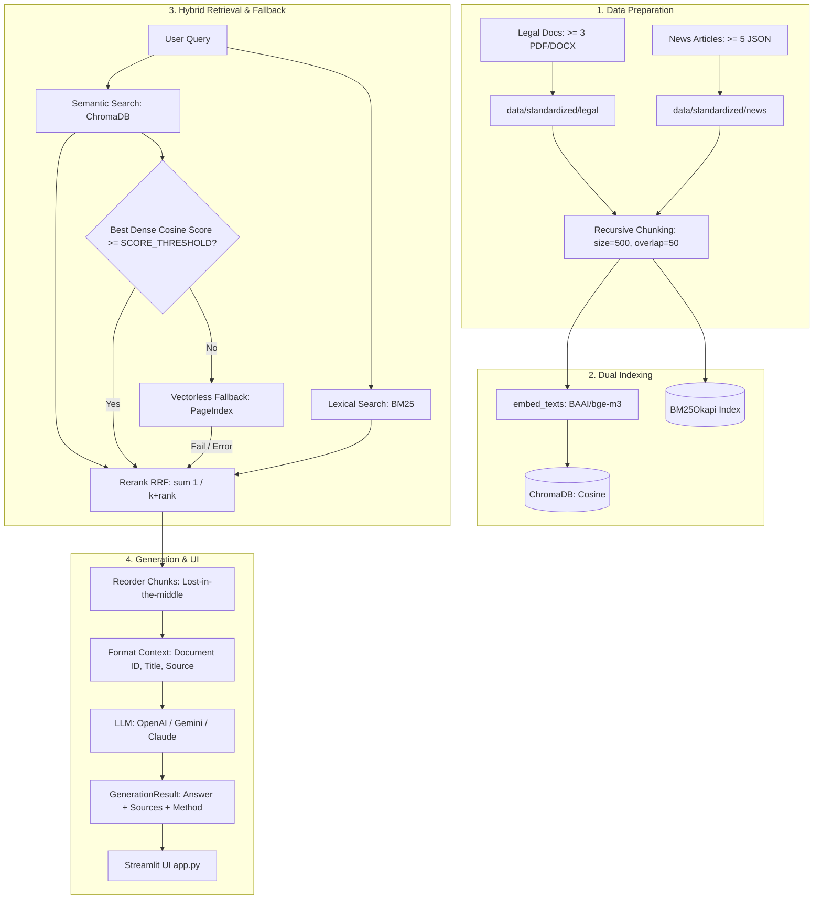

Viewed huongdan.txt:1-195
Viewed README.md:1-85
Listed directory K4-L3A-RAG-Pipeline
Listed directory docs
Viewed STEP_BY_STEP.md:1-107
Viewed GRADING_RUBRIC.md:1-29
Listed directory src
Viewed MODULE_CONTRACTS.md:1-80
Listed directory group_project
Listed directory evaluation
Viewed INDIVIDUAL_REPORT.md:1-57
Listed directory tests
Viewed RESULT.md:1-61
Viewed test_acceptance.py:1-58
Viewed app.py:1-46
Viewed .env.example:1-22
Viewed contracts.py:1-60
Viewed task1_collect_legal_docs.py:1-46
Viewed task4_chunking_indexing.py:1-60
Viewed task5_semantic_search.py:1-42
Viewed task6_lexical_search.py:1-49
Viewed task7_reranking.py:1-42
Viewed task8_pageindex_vectorless.py:1-45
Viewed task9_retrieval_pipeline.py:1-55
Viewed task10_generation.py:1-98
Viewed SUGGESTED_TOPICS.md:1-18
Viewed test_contracts.py:1-100

Dựa trên toàn bộ mã nguồn, các tài liệu hướng dẫn (`huongdan.txt`, [README.md](file:///d:/VinUni-AI/K4-L3A-RAG-Pipeline/README.md), [docs/STEP_BY_STEP.md](file:///d:/VinUni-AI/K4-L3A-RAG-Pipeline/docs/STEP_BY_STEP.md), [docs/MODULE_CONTRACTS.md](file:///d:/VinUni-AI/K4-L3A-RAG-Pipeline/docs/MODULE_CONTRACTS.md), [docs/GRADING_RUBRIC.md](file:///d:/VinUni-AI/K4-L3A-RAG-Pipeline/docs/GRADING_RUBRIC.md)) và bài test tự động trong repository, dưới đây là cẩm nang hướng dẫn chi tiết và đầy đủ nhất dành cho bạn khi chuẩn bị làm **Lab 8 (RAG Pipeline)** cho lớp **3B**.

---

### 1. Hình thức làm bài: Nhóm hay Cá nhân?

> **Kết luận:** Lab 8 là **BÀI TẬP NHÓM**, nhưng có **ĐÁNH GIÁ ĐÓNG GÓP CÁ NHÂN**.

* **Quy mô nhóm:** Mỗi nhóm gồm **3 đến 4 thành viên**. Cả nhóm dùng chung **1 repository** và nộp **1 đường link repository chung trên VLearn**.
* **Trách nhiệm cá nhân:** Dù làm chung repo, **mỗi thành viên bắt buộc phải tự nộp 1 bản báo cáo cá nhân** vào thư mục `reports/` (được sao chép từ template [INDIVIDUAL_REPORT.md](file:///d:/VinUni-AI/K4-L3A-RAG-Pipeline/group_project/%E1%BB%8Bndividual/INDIVIDUAL_REPORT.md)). Báo cáo này yêu cầu kê khai:
  * Module/tính năng mình trực tiếp phụ trách.
  * Bằng chứng đối chiếu: Link PR, commit hash, file cụ thể, kết quả test.
  * Tối đa 2 quyết định kỹ thuật quan trọng và trade-off mà mình tham gia.
  * Điểm hạn chế và hướng cải tiến.
* **Cơ cấu điểm:**
  * **90 điểm nhóm:** Chấm theo sản phẩm chạy được, pipeline, test pass, UI Streamlit, đánh giá A/B và báo cáo [RESULT.md](file:///d:/VinUni-AI/K4-L3A-RAG-Pipeline/group_project/evaluation/RESULT.md).
  * **10 điểm bonus:** HyDE/Query expansion (+3), Advanced Reranker (+3), Chat Memory (+2), Deploy/UI highlighting (+2).
  * Giảng viên sẽ đối chiếu Git log và [INDIVIDUAL_REPORT.md](file:///d:/VinUni-AI/K4-L3A-RAG-Pipeline/group_project/%E1%BB%8Bndividual/INDIVIDUAL_REPORT.md) để đánh giá mức độ tham gia thực tế của từng người.

---

### 2. Phân công vai trò trong nhóm (Đề xuất 4 Roles)

Với thời lượng tiêu chuẩn buổi lab là **3 giờ**, nhóm nên chia 4 vai trò rõ rệt để làm việc song song:

| Vai trò | Phụ trách chính | File code liên quan |
| :--- | :--- | :--- |
| **Role 1: Data Engineer** | Thu thập dữ liệu (cào web, tải PDF/DOCX), chuẩn hóa sang Markdown, kiểm soát metadata. | [task1_collect_legal_docs.py](file:///d:/VinUni-AI/K4-L3A-RAG-Pipeline/src/task1_collect_legal_docs.py)<br>[task2_crawl_news.py](file:///d:/VinUni-AI/K4-L3A-RAG-Pipeline/src/task2_crawl_news.py)<br>[task3_convert_markdown.py](file:///d:/VinUni-AI/K4-L3A-RAG-Pipeline/src/task3_convert_markdown.py) |
| **Role 2: Retrieval Engineer** | Chia đoạn (chunking), tạo vector embeddings, lưu ChromaDB, viết Dense Search & BM25 search. | [task4_chunking_indexing.py](file:///d:/VinUni-AI/K4-L3A-RAG-Pipeline/src/task4_chunking_indexing.py)<br>[task5_semantic_search.py](file:///d:/VinUni-AI/K4-L3A-RAG-Pipeline/src/task5_semantic_search.py)<br>[task6_lexical_search.py](file:///d:/VinUni-AI/K4-L3A-RAG-Pipeline/src/task6_lexical_search.py) |
| **Role 3: Pipeline & Generation / UI** | Thuật toán RRF fusion, fallback logic, LLM generation kèm citation, giao diện Streamlit. | [task7_reranking.py](file:///d:/VinUni-AI/K4-L3A-RAG-Pipeline/src/task7_reranking.py)<br>[task8_pageindex_vectorless.py](file:///d:/VinUni-AI/K4-L3A-RAG-Pipeline/src/task8_pageindex_vectorless.py)<br>[task9_retrieval_pipeline.py](file:///d:/VinUni-AI/K4-L3A-RAG-Pipeline/src/task9_retrieval_pipeline.py)<br>[task10_generation.py](file:///d:/VinUni-AI/K4-L3A-RAG-Pipeline/src/task10_generation.py)<br>[app.py](file:///d:/VinUni-AI/K4-L3A-RAG-Pipeline/app.py) |
| **Role 4: Lead & Evaluation Engineer** | Điều phối repo, tạo golden dataset (15+ Q&A), chạy đánh giá A/B 4 metrics, viết [RESULT.md](file:///d:/VinUni-AI/K4-L3A-RAG-Pipeline/group_project/evaluation/RESULT.md), kiểm tra `pytest`. | [golden_dataset.json](file:///d:/VinUni-AI/K4-L3A-RAG-Pipeline/group_project/evaluation/golden_dataset.json)<br>[RESULT.md](file:///d:/VinUni-AI/K4-L3A-RAG-Pipeline/group_project/evaluation/RESULT.md)<br>[test_acceptance.py](file:///d:/VinUni-AI/K4-L3A-RAG-Pipeline/tests/test_acceptance.py)<br>[test_contracts.py](file:///d:/VinUni-AI/K4-L3A-RAG-Pipeline/tests/test_contracts.py) |

---

### 3. Kiến trúc RAG Pipeline cần xây dựng



---

### 4. Quy trình thực hiện chi tiết từng bước (Step-by-Step)

#### Bước 0: Khởi tạo Repository & Thiết lập môi trường (10 phút)
1. **Quy tắc đặt tên repo của lớp 3B:** Clone starter repo hoặc tạo repo của nhóm với tên: `K4-L3B-RAG-Pipeline` (lưu ý tiền tố **L3B** thay vì L3A).
2. **Cài đặt môi trường:**
   ```powershell
   python -m venv .venv
   .venv\Scripts\activate       # Trên Windows PowerShell
   python -m pip install --upgrade pip setuptools wheel
   python -m pip install -e ".[dev]"
   python -m playwright install chromium
   ```
3. **Cấu hình Secret:**
   * Copy file `.env.example` thành `.env`.
   * Điền API key nhóm sẽ dùng: `OPENAI_API_KEY`, `GEMINI_API_KEY` hoặc `ANTHROPIC_API_KEY`.
   * **Tuyệt đối không commit file `.env` lên GitHub.**
4. **Tạo file `TEAMMATES.md` tại thư mục gốc:**
   Ghi rõ họ tên, MSSV, vai trò, nhánh/phần việc của từng thành viên.

---

#### Bước 1: Thu thập và chuẩn hóa dữ liệu Corpus (25 phút)
*Chọn một chủ đề hẹp, có tài liệu công khai minh bạch (ví dụ: Quy chế học vụ & học bổng VinUni, Tuyển sinh đại học, Du lịch Đà Nẵng, Luật thuế hộ kinh doanh).*

* **Task 1 — [src/task1_collect_legal_docs.py](file:///d:/VinUni-AI/K4-L3A-RAG-Pipeline/src/task1_collect_legal_docs.py):**
  * Tải ít nhất **3 tài liệu** chính sách/quy định (định dạng `.pdf`, `.doc`, `.docx`) lưu vào `data/landing/legal/`. Dung lượng mỗi file phải > 1KB.
* **Task 2 — [src/task2_crawl_news.py](file:///d:/VinUni-AI/K4-L3A-RAG-Pipeline/src/task2_crawl_news.py):**
  * Điền ít nhất **5 URL** vào mảng `ARTICLE_URLS`.
  * Dùng Crawl4AI hoặc BeautifulSoup/Playwright để cào nội dung, lưu thành 5 file `.json` trong `data/landing/news/`.
  * Mỗi file JSON bắt buộc phải có 4 trường metadata: `url`, `title`, `date_crawled`, `content_markdown`.
* **Task 3 — [src/task3_convert_markdown.py](file:///d:/VinUni-AI/K4-L3A-RAG-Pipeline/src/task3_convert_markdown.py):**
  * Chuyển đổi toàn bộ tài liệu chính sách và tin tức sang Markdown, lưu tương ứng vào `data/standardized/legal/*.md` và `data/standardized/news/*.md`.
  * Độ dài nội dung mỗi file `.md` chuẩn hóa phải đạt tối thiểu 200 ký tự.
* **Kiểm tra ngay:**
  ```powershell
  python -m src.task1_collect_legal_docs
  python -m src.task2_crawl_news
  python -m src.task3_convert_markdown
  pytest tests/test_acceptance.py -k "corpus or standardized" -q
  ```

---

#### Bước 2: Chunking, Embedding và Indexing (30 phút)
Tất cả cấu trúc dữ liệu phải tuân thủ nghiêm ngặt [docs/MODULE_CONTRACTS.md](file:///d:/VinUni-AI/K4-L3A-RAG-Pipeline/docs/MODULE_CONTRACTS.md).

* **Task 4 — [src/task4_chunking_indexing.py](file:///d:/VinUni-AI/K4-L3A-RAG-Pipeline/src/task4_chunking_indexing.py):**
  1. `load_documents()`: Quét toàn bộ `.md` trong `data/standardized/`, gán `id` duy nhất và metadata (`source`, `title`, `doc_type`, `url`).
  2. `chunk_documents()`: Cắt đoạn bằng thuật toán Recursive Character Text Splitter (mặc định `chunk_size=500`, `chunk_overlap=50`). Mỗi chunk bổ sung trường `chunk_index: int`.
  3. `embed_texts()`: Hàm sinh vector embedding (dùng model cục bộ `BAAI/bge-m3` qua `sentence-transformers` hoặc API của OpenAI/Gemini).
     > **Lưu ý cốt tử:** Hàm `embed_texts()` này phải được dùng chung cho cả việc index dữ liệu (Task 4) và vector hóa câu hỏi tìm kiếm (Task 5).
  4. `get_collection()` & `index_to_vectorstore()`: Tạo ChromaDB persistent client, dùng metric `{"hnsw:space": "cosine"}`, tiến hành **upsert** chunks (đảm bảo chạy lại script nhiều lần không làm nhân bản dữ liệu).
* **Kiểm tra:**
  ```powershell
  python -m src.task4_chunking_indexing
  ```

---

#### Bước 3: Tìm kiếm ngữ nghĩa (Dense) & Từ khóa (BM25) (25 phút)
* **Task 5 — [src/task5_semantic_search.py](file:///d:/VinUni-AI/K4-L3A-RAG-Pipeline/src/task5_semantic_search.py):**
  * Dùng `embed_texts([query])` để vector hóa query.
  * Query ChromaDB lấy top_k kết quả. Chuyển đổi khoảng cách cosine thành similarity: `score = max(0.0, 1.0 - distance)`.
  * Trả về danh sách `SearchResult` sắp xếp giảm dần theo score, gắn cờ `retrieval_method="dense"`.
* **Task 6 — [src/task6_lexical_search.py](file:///d:/VinUni-AI/K4-L3A-RAG-Pipeline/src/task6_lexical_search.py):**
  * Dùng thư viện `rank_bm25` (`BM25Okapi`) trên cùng tập chunks với Task 4.
  * Trả về `SearchResult` với `retrieval_method="bm25"`.
* **Kiểm tra:**
  ```powershell
  pytest tests/test_contracts.py -k "search or chunk" -q
  ```

---

#### Bước 4: Hợp nhất thứ hạng RRF & Fallback Logic (25 phút)
* **Task 7 — [src/task7_reranking.py](file:///d:/VinUni-AI/K4-L3A-RAG-Pipeline/src/task7_reranking.py):**
  * Viết hàm `rerank_rrf(ranked_lists, top_k=5, k=60)`:
    $$\text{RRF\_score}(d) = \sum_{m \in M} \frac{1}{k + \text{rank}_m(d)}$$
    *(với $\text{rank}$ bắt đầu từ 1).*
  * **Quy tắc bất biến:** Copy object trước khi gán score mới và đặt `retrieval_method="hybrid"`. Không được sửa trực tiếp list/dict ban đầu.
* **Task 8 — [src/task8_pageindex_vectorless.py](file:///d:/VinUni-AI/K4-L3A-RAG-Pipeline/src/task8_pageindex_vectorless.py):**
  * Tích hợp tìm kiếm không dùng vector (PageIndex) hoặc mock API fallback an toàn khi mạng lỗi để app không bao giờ bị crash.
* **Task 9 — [src/task9_retrieval_pipeline.py](file:///d:/VinUni-AI/K4-L3A-RAG-Pipeline/src/task9_retrieval_pipeline.py):**
  * Hàm `retrieve(query, top_k, score_threshold)`:
    1. Gọi cả Dense search và BM25 search.
    2. Fuse kết quả qua RRF **đúng một lần**.
    3. Lấy **cosine score gốc cao nhất của Dense search** (tuyệt đối không dùng điểm RRF) đem so sánh với `SCORE_THRESHOLD`.
    4. Nếu cosine score < `SCORE_THRESHOLD`, kích hoạt fallback (PageIndex). Nếu fallback gặp sự cố, trả về kết quả hybrid hoặc safe refusal.
* **Kiểm tra contract:**
  ```powershell
  pytest tests/test_contracts.py -q
  ```

---

#### Bước 5: Generation có trích dẫn nguồn & Giao diện Streamlit (30 phút)
* **Task 10 — [src/task10_generation.py](file:///d:/VinUni-AI/K4-L3A-RAG-Pipeline/src/task10_generation.py):**
  1. `reorder_for_llm(chunks)`: Đảo vị trí chunk (đoạn quan trọng ở đầu và cuối context) để giải quyết hiện tượng *Lost in the Middle*. Giữ nguyên ID chunk.
  2. `format_context(chunks)`: Gắn nhãn định dạng rõ ràng: `[Document X | Title: ... | Source: ...]`.
  3. `call_llm()`: Kết nối với API LLM (OpenAI / Gemini / Anthropic).
  4. `generate_with_citation()`: Trả về `GenerationResult` (`answer`, `sources`, `retrieval_source`). Nếu context rỗng hoặc ngoài domain, kích hoạt **Safe Refusal** ("Tôi không thể xác minh thông tin này từ nguồn hiện có", `sources=[]`, `retrieval_source="none"`).
* **Ứng dụng Streamlit — [app.py](file:///d:/VinUni-AI/K4-L3A-RAG-Pipeline/app.py):**
  * Nhận câu hỏi người dùng, slider chọn `top_k`.
  * Hiển thị câu trả lời bot.
  * Hiển thị danh sách nguồn trích dẫn: Click vào xem được tiêu đề, URL/file nguồn, phương thức tìm kiếm (`dense`/`bm25`/`hybrid`) và điểm số liên quan.
* **Chạy thử giao diện:**
  ```powershell
  streamlit run app.py
  ```

---

#### Bước 6: Đánh giá A/B & Báo cáo kết quả (30 phút)
* **Tạo Golden Dataset — [group_project/evaluation/golden_dataset.json](file:///d:/VinUni-AI/K4-L3A-RAG-Pipeline/group_project/evaluation/golden_dataset.json):**
  * Viết tối thiểu **15 trường hợp Q&A**.
  * Mỗi item bắt buộc có 3 trường: `question`, `expected_answer`, `expected_context` (phải lấy từ nội dung thực tế của tài liệu đã thu thập, không bịa từ kiến thức bên ngoài).
* **Thực hiện đánh giá A/B:**
  * **Config A:** Dense-only retrieval (`semantic_search`).
  * **Config B:** Hybrid retrieval + RRF (`retrieve`).
  * Cả 2 cấu hình phải giữ cố định: tập test 15 câu, model LLM, prompt, và `top_k`.
* **Đo lường 4 chỉ số RAG:**
  1. *Faithfulness* (Độ trung thực - không bịa ngoài context).
  2. *Answer Relevance* (Mức độ câu trả lời giải quyết trúng câu hỏi).
  3. *Context Recall* (Mức độ retrieval bao phủ đủ bằng chứng cần thiết).
  4. *Context Precision* (Độ tập trung, ít nhiễu của các đoạn retrieval).
* **Hoàn thiện báo cáo [group_project/evaluation/RESULT.md](file:///d:/VinUni-AI/K4-L3A-RAG-Pipeline/group_project/evaluation/RESULT.md):**
  * Xóa toàn bộ chữ `TODO`.
  * Điền bảng so sánh tổng thể và tính mức chênh lệch ($\Delta B - A$).
  * Phân tích chi tiết **Top 3 trường hợp tệ nhất (Worst Performers)**: Xác định lỗi xảy ra ở tầng nào (Data, Retrieval hay Generation) và nguyên nhân gốc rễ (Root cause).
  * Đưa ra khuyến nghị (Recommendations) có cách kiểm chứng lại.

---

#### Bước 7: Kiểm thử tổng thể & Hoàn tất nộp bài (20 phút)
1. **Chạy toàn bộ automated tests:**
   ```powershell
   pytest tests/test_contracts.py -q
   pytest tests/test_acceptance.py -q
   pytest -q
   ```
   *Yêu cầu: 100% test phải chuyển sang màu xanh (PASS).*

2. **Viết Báo cáo cá nhân:**
   Mỗi bạn tạo file `reports/K4-L3B-<Mã_Học_Viên>-<Họ_Tên>.md` dựa trên [INDIVIDUAL_REPORT.md](file:///d:/VinUni-AI/K4-L3A-RAG-Pipeline/group_project/%E1%BB%8Bndividual/INDIVIDUAL_REPORT.md).

3. **Rà soát trước khi commit/push:**
   * Không commit `.env`, không lộ API Key, không commit thư mục cache / vectorstore rác.
   * Cấu trúc thư mục khớp chuẩn checklist:
     ```text
     K4-L3B-RAG-Pipeline/
     ├── TEAMMATES.md
     ├── README.md
     ├── app.py
     ├── data/
     │   ├── landing/ (legal/, news/)
     │   └── standardized/ (legal/, news/)
     ├── src/ (task1 -> task10, contracts)
     ├── tests/ (test_contracts, test_acceptance)
     ├── group_project/
     │   └── evaluation/ (RESULT.md, golden_dataset.json)
     └── reports/
         └── K4-L3B-<MSSV>-<Name>.md (cho từng thành viên)
     ```
4. **Nộp bài:** Copy link Git repository của nhóm nộp lên hệ thống VLearn.

---

### 5. Những "bẫy" kỹ thuật thường bị trừ điểm (Cần đặc biệt lưu ý)

1. **So sánh sai điểm số ở bước Fallback:** Điểm sau RRF chỉ dao động trong khoảng cực nhỏ ($~0.01 - 0.03$), trong khi Cosine similarity nằm trong khoảng $0.0 - 1.0$. Nếu đem so sánh điểm RRF với `SCORE_THRESHOLD = 0.3`, nhánh fallback sẽ luôn bị kích hoạt sai! Phải dùng **cosine score gốc của dense retrieval**.
2. **Lệch Embedding Model:** Task 4 (index) dùng model nào thì Task 5 (query) bắt buộc phải gọi chung hàm `embed_texts()` với model đó.
3. **Phá vỡ Contract:** Tuyệt đối không thay đổi tên hàm, tên tham số hay cấu trúc output đã được định nghĩa trong [docs/MODULE_CONTRACTS.md](file:///d:/VinUni-AI/K4-L3A-RAG-Pipeline/docs/MODULE_CONTRACTS.md) vì `test_contracts.py` dùng `inspect.signature` để chấm tự động.
4. **Để sót chữ "TODO" trong [RESULT.md](file:///d:/VinUni-AI/K4-L3A-RAG-Pipeline/group_project/evaluation/RESULT.md):** `test_acceptance.py` sẽ tự động FAIL nếu trong file này còn bất kỳ chữ `TODO` nào.